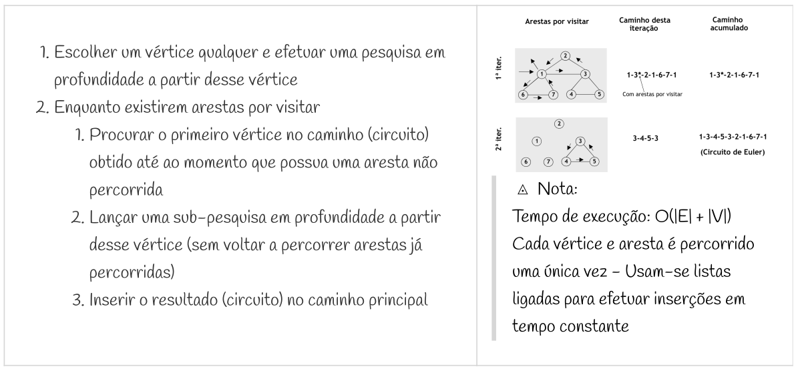

<h1 style="text-align: center;">markdown-notes</h1>

<h3 style="text-align: center;">Templates for your Note Taking Markdown Workflow</h3>

## Contents

- [Contents](#contents)
- [Overview](#overview)
- [Installation (CLI)](#installation-cli)
- [Using](#using)
  - [Templates Folder](#templates-folder)
  - [CLI app](#cli-app)
- [Examples](#examples)
- [Themes](#themes)
  - [Default Theme](#default-theme)
- [License](#license)

## Overview

**Based on some effective study methods, these markdown templates are designed to help on creating better study materials, faster and directly from your computer. Only markdown or html/css skills are required. The styles fully customizable!**

This is a two versions package. All the working files are contained in these folders:
* [Templates](templates/) - for the markdown templates
* [Styles](styles/) or [Themes](themes/) - for the styling themes

> **Important**  
> The extension [Markdown Preview Enhanced
](https://shd101wyy.github.io/markdown-preview-enhanced/#/), available for VSCode and Atom is required, not only for the notes' styled preview but also for a better html export.

1. If you do want to install the CLI app, a simple caller that creates the files on your current directory, follow the instructions in the next [section](#installation-cli).  
2. Else, if you only need the templates, copy the files you need, from the previously mentioned folders, paste them wherever you want and start editing them. A Pro Tip is using your machine *Templates* folder for a faster template creation.

## Installation (CLI)

> The node and npm packages are required to be installed on your system. 

First, `git clone` this repo. Then go to the downloaded folder and run 

`$ npm install`  
to install the dependencies

`$ chmod +x md-notes.js`  
to make the program executable

`$ npm link`  
or  
`$ sudo npm link`  
to create a bin link and make it possible to call the program globally on your machine.

If everything went with no errors, a successful installation was accomplished.  
So... Start [using](#cli-app) it!

## Using

... Having everything set up, 

### Templates Folder

If these files are on your machine *Templates* folder, you can easily spawn them on any folder using your file manager context menu.

### CLI app

Else, if you installed the CLI app version, then you need only to run 

`$ md-notes` 

on your terminal in the desired directory and choose the suitable options.

----
Finally, open your Text Editor to start crafting and visualizing your markdown notes.

Search for a *Markdown Preview Enhanced* **Preview Button** on the top corners of your editor to open the viewer tab. Search for the extension shortcuts or buttons to export your notes to html, for then printing them to pdf.

> See the [Themes](#themes) for an overview of the expected visual results

## Examples

There is a [folder](examples/) containing examples of these note templates. They were also exported to html, using the recommended VSCode/Atom extension, and then printed to pdf, directly from the browser.

## Themes

Currently, there is only one featured theme, the [Default Theme](themes/default/).  
More customizations may come in the future. 

**Contributions are also appreciated!**

### [Default Theme](themes/default/)

Some aspects/components of this theme are:
|||
--|--
| h1 or # |  |
| h2 or ## |  |
| h3 or ### |  |
| h4 or #### |  |
| h5 or ##### | Similar to h4, but smaller. |
| h6 or ###### |   This will appear with a grey background color when previewing or in html. |
| blockquote or > |  |
| table |  |
| hr or ---- | Not displayed. It is used for page breaks when printing to pdf. |

## License
